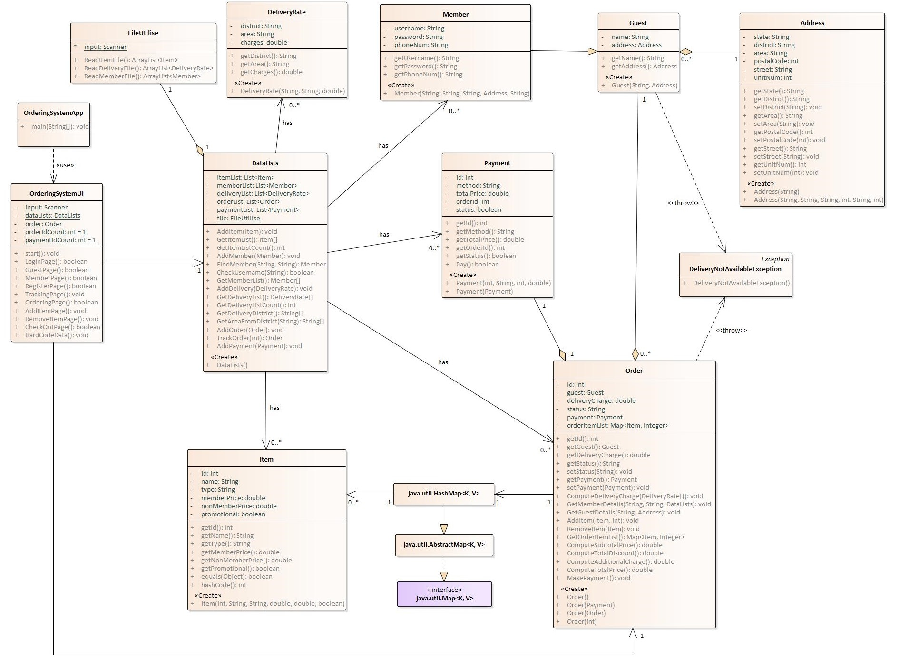
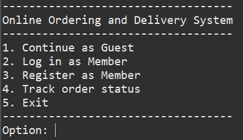
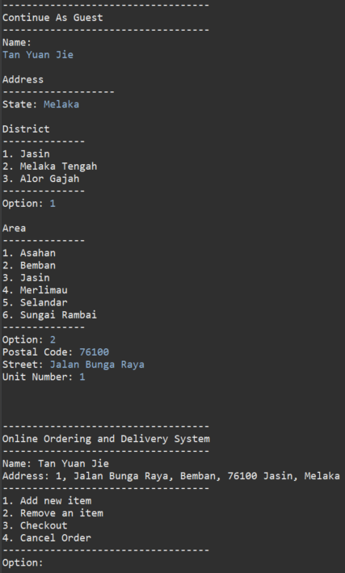
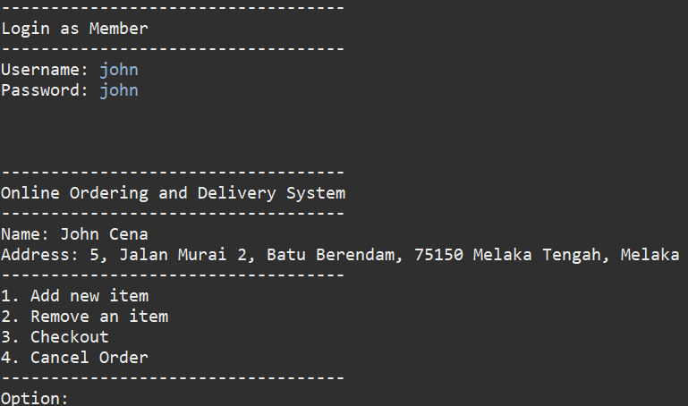
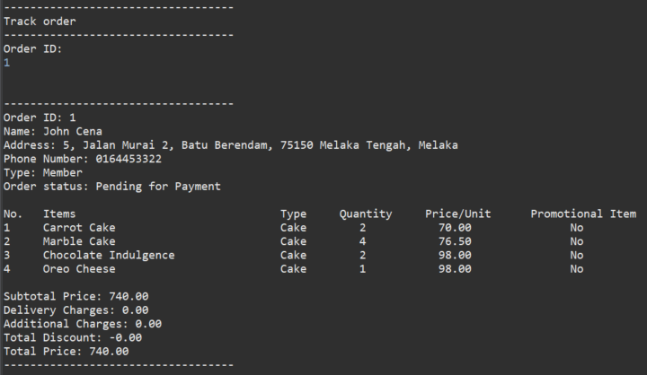
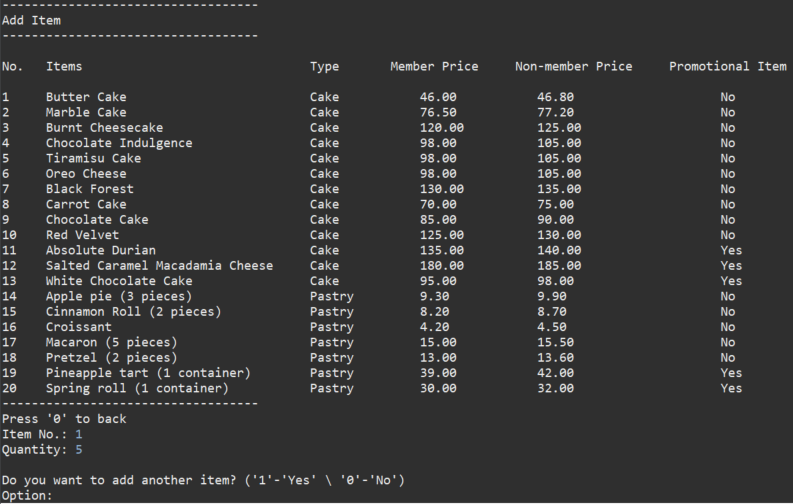
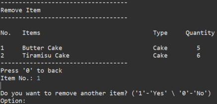
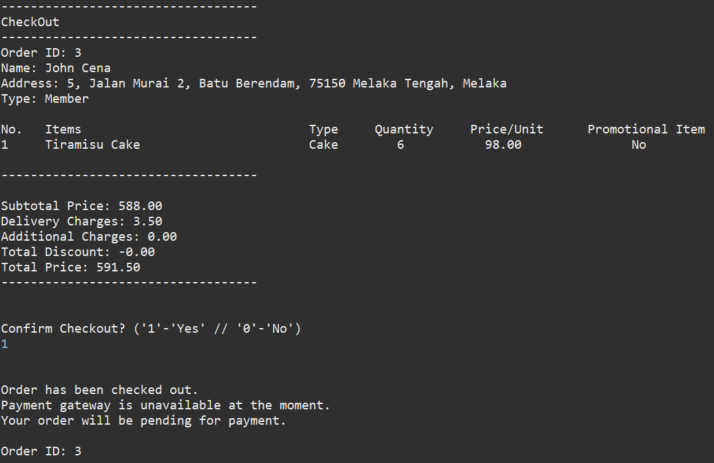
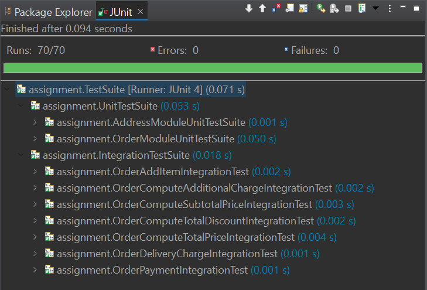

# OrderingManagementSystem
<!-- ALL-CONTRIBUTORS-BADGE:START - Do not remove or modify this section -->

<!-- ALL-CONTRIBUTORS-BADGE:END -->

## Overview

Mrs Kiah used to sell homemade cakes and pastries from home. Due to the covid-19 pandemic situation, her business was hugely affected, and she decided to move her business into an online platform to survive in the industry. To help Mrs Kiah, we will be developing an online ordering and delivery management system.

Additionally, this system applies OOP approach.

For this system, the homemade cakes and pastries ordering page is developed and tested, which allows the user to choose the items and quantities, to track status of the order and calculate the total price accordingly before proceeding for payment. The requirements for the order module, functions of the system and system assumptions are as follows:

#### Order Module Requirements

1. A user can order the homemade cake and pastries from the system.
2. A user can choose one or more items from the system.
3. The user can register as member or be a guest user.
4. Each item has member and non-member price.
5. There will be an additional 5% discount for promotional items.
6. A minimum order of RM25 has to be met. Otherwise, there will be an additional charge.
7. The payment for ordered item and delivery has to be made using the online payment gateway and once the payment successful, the order will be process for delivery.
8. The delivery is only within Melaka and there’s a delivery charge depending to the area in Melaka.
9. The listing of items and delivery charges are given in the following tables.

      ##### Item Listing
      |       **Name**                               | **Type**      | **Member Price (RM)** | **Non-member price (RM)** | **Promotional item** |
      |:---------------------------------------------|:-------------:|:---------------------:|:-------------------------:|:--------------------:|
      |     Butter cake                              |      Cake     |     46.00             |           46.80           |          No          |
      |     Marble cake                              |      Cake     |     76.50             |           77.20           |          No          |
      |     Burnt Cheesecake                         |      Cake     |     120.00            |           125.00          |          No          |
      |     Chocolate Indulgence                     |      Cake     |     98.00             |           105.00          |          No          |
      |     Tiramisu Cake                            |      Cake     |     98.00             |           105.00          |          No          |
      |     Oreo Cheese                              |      Cake     |     98.00             |           105.00          |          No          |
      |     Black Forest                             |      Cake     |     130.00            |           135.00          |          No          |
      |     Carrot Cake                              |      Cake     |     70.00             |           75.00           |          No          |
      |     Chocolate Cake                           |      Cake     |     85.00             |           90.00           |          No          |
      |     Red Velvet                               |      Cake     |     125.00            |           130.00          |          No          |
      |     Absolute Durian                          |      Cake     |     135.00            |           140.00          |          Yes         |
      |     Salted   Caramel     Macadamia Cheese    |      Cake     |     180.00            |           185.00          |          Yes         |
      |     White   Chocolate Cake                   |      Cake     |     95.00             |           98.00           |          Yes         |
      |     Apple pie (3 pieces)                     |     Pastry    |     9.30              |           9.90            |          No          |
      |     Cinnamon Roll (2 pieces)                 |     Pastry    |     8.20              |           8.70            |          No          |
      |     Croissant                                |     Pastry    |     4.20              |           4.50            |          No          |
      |     Macaron    (5     pieces)                |     Pastry    |     15.00             |           15.50           |          No          |
      |     Pretzel      (2 pieces)                  |     Pastry    |     13.00             |           13.60           |          No          |
      |     Pineapple tart (1 container)             |     Pastry    |     39.00             |           42.00           |          Yes         |
      |     Spring roll   (1 container)              |     Pastry    |     30.00             |           32.00           |          Yes         |
      |     Chocolate Cake                           |      Cake     |     85.00             |           90.00           |          No          |
      |     Red Velvet                               |      Cake     |     125.00            |           130.00          |          No          |
      |     Absolute Durian                          |      Cake     |     135.00            |           140.00          |          Yes         |

      ##### Delivery Charges Listing
      |**Area**         |**Delivery rate (RM)**|
      |:---------------:|:--------------------:|
      |Alor Gajah       |        2.50          |
      |Asahan           |        4.00          |
      |Ayer Keroh       |        5.00          |
      |Bandar Hilir     |        5.00          |
      |Batu Berendam    |        3.50          |
      |Bemban           |        4.00          |
      |Bukit Beruang    |        3.50          |
      |Durian Tunggal   |        3.50          |
      |Jasin            |        4.00          |
      |Kuala Linggi     |        3.00          |
      |Kuala Sungai Baru|        3.00          |
      |Lubok China      |        3.00          |
      |Masjid Tanah     |        2.50          |
      |Melaka Tengah    |        5.00          |
      |Merlimau         |        4.00          |
      |Selandar         |        4.00          |
      |Sungai Rambai    |        2.50          |
      |Sungai Udang     |        2.50          |
      |Tanjong Kling    |        4.50          |
      |Ujong Pasir      |        4.50          |

#### Functions
1. Continue as Guest
2. Login as Member
3. Register as Member
4. Track Order
5. Add New Item
6. Remove an Item
7. Checkout

#### System Assumptions
1.	All the data stored inside text file are valid. Therefore, no validation or testing are needed on the data retrieved from the text file.
2.	The order cannot be check out if there are no items in the order.
3.	The user can track the order by the order id. Each order id is unique and will be shown to user once the order is checked out.
4.	Name should contain only alphabets.
5.	Postal Code of address should contain only 5 digits.
6.	Street of address should contain only alphabets, number is allowed only at the end to specify the street number.
7.	Total order is subtotal price – total discount.

## Tools
1. Java
2. JUnit 4
3. JUnitParams 1.0.2
4. Mockito 1.9.5
5. Eclipse IDE 2021-03

## Usage
Import the files into your project. 
Copy and paste all JAR files (jUnitParams & Mockito) in C:\jars. 
Run the project with Java compiler. 
**# Make sure JDK version is above 10.**

## Application Design
### Class Diagram

## Test

#### Objective
This document describes the test plan for the online ordering and delivery management system. The objectives of this test plan are as follows:
1.	To assure that the system meets the full requirements for the order module of the system. At the end of the development cycle of the project, the project should meet all the expectations as detailed in the requirements.
2.	To identify and expose issues, bugs, defects and associated risks and provide all known issues to the development team, ensuring that all known issues are addressed in an appropriate way before releasing.

#### Scope
The scope of this test plan is to perform unit testing and integration testing on the online ordering page of the online ordering and delivery management system. 
The features to be tested are as follows:
1.	**Address module**  
The main test on this module is to validate the delivery state. Since the delivery is only available within Melaka, the delivery address should be with state = Melaka.
2.	**Order module**  
There are several tests to be performed on this module. 
    - Add items and quantity into an order  
      The order should contain accurate items and relative quantity from the input of user.
    - Remove item from an order  
      The order should not contain the removed item after user remove the item from the order.
    - Get delivery charges of the order  
      The delivery charges should be computed based on the area specified in the delivery rates list. If the area is not found, the order cannot be proceed.
    - Compute subtotal price of an order  
      The subtotal price should be computed based on the membership of the customer. If the order is made by guest, the subtotal price should be computed with non-member price, else, the subtotal price should be computed with member price.
    - Compute total discount of an order  
      Since some of the items are promotional items, the total discount should be computed for these promotional items.
    - Compute additional charge 
      An additional charge of RM3 should be added if the total order is less than RM25.
    - Compute total price 
      The total price of an order should be computed by the sum the subtotal price, additional charge as well as delivery charge and subtract it with the total discount of the order.
    - Track Order 
      Each order should has unique id number and the information of the order should be retrieved when user track the order with its id number.
    - Update order status 
      The order status will be updated to “Paid & Ready for Delivery” once the payment is made, else, the order status will remain “Pending for Payment”.

Since the focus of this test plan is to test the ordering page of the system, the features that are not related to ordering will not be tested. The features not to be tested are as following:

1.	DeliveryRate module
2.	Guest module
3.	Member module
4.	Item module
5.	DataLists module
6.	Payment module

## Previews
1. Main Menu     
2. Continue as Guest     
3. Login as Member     
4. Track Order     
5. Add New Item     
6. Remove an Item     
7. Checkout     
8. Test Report     

## Contributors ✨

Thanks goes to these wonderful people ([emoji key](https://allcontributors.org/docs/en/emoji-key)):

<!-- ALL-CONTRIBUTORS-LIST:START - Do not remove or modify this section -->
<!-- prettier-ignore-start -->
<!-- markdownlint-disable -->
<table>
  <tr>
    <td align="center"><a href="https://github.com/yuanjie8629"> <b>Tan Yuan Jie</b></a> <a href="https://github.com/yuanjie8629/OrderingManagementSystem/commits?author=yuanjie8629" title="Code">💻</a> <a href="#data-yuanjie8629" title="Data">🔣</a> <a href="https://github.com/yuanjie8629/OrderingManagementSystem/commits?author=yuanjie8629" title="Documentation">📖</a> <a href="#ideas-yuanjie8629" title="Ideas, Planning, & Feedback">🤔</a> <a href="#infra-yuanjie8629" title="Infrastructure (Hosting, Build-Tools, etc)">🚇</a> <a href="https://github.com/yuanjie8629/OrderingManagementSystem/commits?author=yuanjie8629" title="Tests">⚠️</a></td>
  </tr>
</table>

<!-- markdownlint-restore -->
<!-- prettier-ignore-end -->

<!-- ALL-CONTRIBUTORS-LIST:END -->

This project follows the [all-contributors](https://github.com/all-contributors/all-contributors) specification. Contributions of any kind welcome!